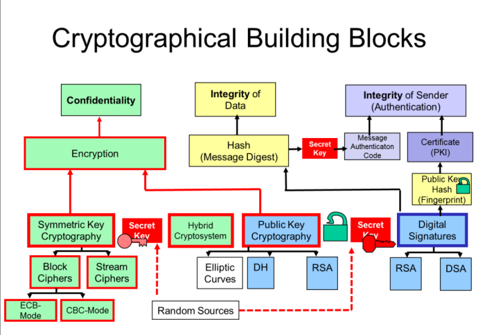

# Informationssicherheit 1
## Allgemein
### Unterlagen
* Ebooks
    * Wolfgang Ertel, Angewandte Kryptographie, Hanser, 2012
    * Jörg Schwenk, Sicherheit und Kryptographie im Internet, Springer Fachmedien Wiesbaden, 2014

(eins von beiden)

* [Kahn Academy Computer Science, Journey into cryptography](https://www.khanacademy.org/computing/computerscience/cryptography)

---

## Vorlesung 1 - Begriffe / Risk-Management

* **Folie 6**
    * Confidentiality (auch Privacy)
    * Integrity (Echtheit)
    * Availability
    * Kurz: CIA

* **Chat:** Management - Welches sind die wichtigsten Aufgaben eines Managers
    - Planung
    - Unterstützung der Realisierung
    - Kontrolle
    - Korrektur

---

## Vorlesung 2 - Standards

* **Folie 2**
    De-facto Standards beispiele: ASCII (später ANSI standard), Ethernet (später IEEE-Standard), SQL

* **Chat**: Wozu nutzen wir Standards?
    - Kompatibilität gewährleisten
    - Markterweiterung
        - Differenzieren gegenüber Mitbewerber (z.B.Autoindustrie)
    - Kundenanforderung
    - Unabhängige Prüfung (Zertifizierung)
    - Bessere Qualität
    - Auszeichnung (Gütesiegel)

* **Folie 5**
JTC: Joint Technical Committee

* **Folie 25**
    * 27001 gibt an, wie das ISMS aussehen soll
    * 27002 gibt best practises für die Umsetzung an
    * 27006: Diese Anforderungen müssen von Auditors erfüllt werden, damit sie andere mit 27001 zertifizieren können

* **Folie 27:**
    * iso 27001 gilt nicht nur für IT-Systeme, sondern für Firmeninformation allgemein
    * definiert auch Prozesse (zb. Changemanagement)

* **Folie 36:** Unterschied 27001 vs. 27002
    * 27001: Sagt was zu tun ist und was die Norm ist
    * 27002: Sagt was wie zu tun ist mit Umsetzungshinweisen

---
## Vorlesung 3 - Gefährdungen

### Notizen Referat Hyppönen

* Job war früher "Computer sichern"
* Ist zu einem sichern "der Gesellschaft" geworden, da alles af Computern läuft
* Mit einem Netzwerk, das gross genug ist, ist es fast umöglich, es komplett zu beschützen
* Viren und co. werden von kriminellen Organisationen gschrieben
* Angreifer verschieben Server ständig in der Welt, was ausnutzt, dass überall andere Rechte gelten
* Angriffe von staatlichen Organisationen
* Hacktivismus: Angriffe aus politischer Motivation
    * Z.b. Attacke auf Sony von Nordkorea aus wegen Film

---
## Vorlesung 4 - Massnahmen / Informationsquellen

* **Folie 8:**  
    Personal Firewall hat Kopplung zu den Applikationen (kann auch Applikationen unterscheiden)

* **Folie 12:**  
    Same origin policy: zb. nur Anfragen von einem bestimmten Server erlauben

* **Folie 19:**  
    Bei biologischen Merkmalen gibt es immer Fehlerraten: Wie viel Toleranz hat die Software?

* **JUST-Culture**  
    * Heisst auch, Regeln u.U zu brechen (eigene Entscheidungen treffen)
    * Fehler / Misstände melden

---
## Vorlesung 5 - Cryptobasics

* **Folie 9:**  
    Ansatz: LSB des Host-Images mit MSB des Covert-Images ersetzen.

* **Folie 17:**  
    Chat: Überprüfen, ob man den richtigen Schlüssel hat: Zb. mit Dictionary abgleichen, Meta-Informationen prüfen, Ethernet-Checksums (grundsätzl.: Ist der Test "sinnvoll"?)

!!! note
    Siehe auch:
     <https://www.khanacademy.org/computing/computer-science/cryptography/crypt/v/intro-to-cryptography>

* **Folie 23: Chat:**  
Kein "e" im Text

* **Folie 28: Chat**
    * Würfelzeichen: \( H(X) = 2.58 \)
    * Buchstaben \( ABCD = 1.75 Bit \)

* **Folie 32:**  
    "Welcome to all Workshop Participants"

* **Folie 47:**  
    \(26!\) mögliche Schlüssel = \(4 * {10}^{26}\)

* **Folie 51:**  
    zb. häufigstes Zeichen suchen und annehmen, dass es "e" ist

* **Folie 55: Vigenere**  
    Jeder Buchstabe wird mit einer anderen Anzahl verschoben

* **Folie 60:**  
    Geheimcode wird immer wiederholt. Wenn man die länge kennt, ist zb. jedes 6te Zeichen gleich weit verschoben, kann man jedes 6te Zeichen analysieren (wieder mit verteilung)

* **Folie 63:**  
    Lösung: WOPK...

* **Folie 67:**  
    XOR-Verknüpfungen
    
---    
## Vorlesung 6 - Encryption
* **Folie 6**
    * A5/1 hat geheimen Algorithmus (security by obscurity), wurde aber schnell geknackt
* **Folie 9**
    * Plaintext XOR Cipher Stream = Ciphertext
    * Ciphertext XOR Cipher Stream = Plaintext
    * Problem: Takt muss exakt stimmen
    * PRNG generiert aus kurzer Zeichenfolge einen pseudo-zufälligen Cipher-Stream
* **Folie 11**
    * \(2^k\) mögliche Zustände, d.h spätestens dann wiederholt es sich
    * Problem mit 0-Folge
* **Chat Folie 12**
    * Immer 1., 2. und letztes Bit XOR
    * Max. \(2^n - 1\) Länge
* **Folie 14**
    * Reihe X korreliert mit Output -> Attacke möglich
* **Folie 18**
    * IV: Initalisierungsvektor (beiden bekannt)
    * Braucht mit Brute-force nur noch \(2^{40}\) Möglichkeiten
* **Chat Folie 20**
    * Hex: 4 bit
    * Base64: 6 bit
    * Ziffern: 3.3 bit
    * Alphabet: \(\log_2{(26)} = 4.7\;\text{bit}\)
    * Alphabet & Ziffern: \(\log_2{(26)} = 5.1\;\text{bit}\)
    * In der Praxis sind die Zeichen aber nicht zufällig gewählt, der Informationsgehalt ist also wesentlich geringer
---
## Vorlesung 7 - Asymmetric Encryption
* **Folie 3**
    * Public-Key Verfahren ist grundsätzlich Block-Cipher
    * RSA oder ECC (Eliptic-Curve-Cryptography)
    * RSA: Large Key-Size: 2048bit (Symmetrisch: zb. AES256)
    * ECC: Small Key Size (224bit)
* **Folie 4**
    * Key-Exchange (Public Key Distribution): Public-Key-Verfahren, um symmetrischen Key auszutauschen (Diffie-Hellmann, ECC)
* **Folie 7 Chat**
    * \(A_s = \frac{n(n-1)}{2} = 4950 \)
    * \(A_p = 100\)
* Animation Faktorisieren vs. Multiplizieren: <https://www.khanacademy.org/computing/computer-science/cryptography/modern-crypt/p/time-complexity-exploration>
* **Folie 17**
    * Generieren einer Zufallszahl zb. mit Mausbewegungen
    * Primzahl wählen: <http://crypto.stackexchange.com/questions/1970/how-are-primes-generated-for-rsa>
* **Folie 19**  
    GCHQ hat schon 1970 das gleiche Verfahren wie bei RSA entwickelt
---
## Vorlesung 8 - Digital Signatures

* **Folie 2**
    * Authenticity: Person ist die, wofür sie sich ausgibt
* **Folie 4**
    * "to hash": Etwas zerhacken
    * Bildet Daten variable Länge in ein Code fixer Länge ab
    * -> Verschiedene Meldungen führen auf denselben Hash
    * Auch MDC (Modification Detection Code), oder Message Digest (MD)
    * Einweg-Funktion, zurückrechnen darf nicht möglich sein
    * Hash wird verschlüsselt -> Keyed Hash
    * MAC: Message Authentication Code
    * Idee Signaturen: Hash mit private key verschlüsseln, der Empfänger entschlüsselt mit public key (beweist Authentizität)
* **Folie 10**
    * Komplexität: \(2 * 2^{56} = 2^{57}\), beide Hashes können einzeln angegriffen werden
* **Folie 13**
    * In gefälschten Meldungen Zusatztext einfügen, bis gleicher Hash entsteht wie bei Ursprungsnachricht
* **Folie 32**
    * Anforderungen:
        * Hohe Geschwindigkeit, aber nicht zu schnell
        * 1 Bit veränderung -> komplett anderer Hash
        * Kollisionen verhindern
    * Zu Programmen angebene Hashes
        * Schlechte Idee, weil auf der Website einfach der Hash ausgetauscht werden könnte
* **Folie 45**
    * Links: Private key von Bob
    * Rechts: Public Key von Bob

---
## Vorlesung 9 - Zertifikate und PKI

* **Chat Folie 5**
    * MITM kreiert eigener Key und gaukelt Alice vor, es sei der der Bank
    * Alice verschlüsselt mit dem falschen Key, MITM kann es lesen
    * MITM verschlüsselt mit dem echten Key der Bank und schickt es weiter (und umgekehrt)
* **Folie 9**
    * Fingerprint ist Hash des Public Keys
* **Folie 15**
    * PGP-Code wurde auf Bücher gedruckt und exportiert (dank Meinungsfreiheit in den USA)
* **Chat Folie 16**
    * \(x^6 = 7 \cdot 10^9 \rightarrow x = 43.7\)
    * not everyone knows 50 other people (some are not mutually exclusive)
* **Folie 32**
    * Codierung in Base64 für 6-Bit ASCII Darstellung
    * pem: Darstellbarer text (ASCII 6-bit)

    

---
## Vorlesung 10 - TLS/SSL

* **Folie 2 Chat**
    * "High Performance" ist Werbespruch, Zertifikat hat nichts mit der Performance zu tun
    * Bob erhält nicht eine "Kopie" des Certs, nur ein signierter Public Key
* **Folie 7**
    * Signer ist die CA
    * CA signiert Public-Key des Servers
* **TLS Handshake - Folie 15**
    * Key Exchange
        * Client schickt zufallszahl + cipher list
        * Server antwortet mit gewünschtem Cipher + Certificate + Session ID
        * Client prüft Cert
        * Client bildet aus allen Zufallszahlen einen "Master Key" und schickt ihn verschlüsselt zum Server
        * Server und Client haben nun gemeinsamen Symmetric key
        * `ChangeSipherSpec`: Wechseln von asymmetrisch zu symmetrischer Verschlüsselung
    * Encrypted Session
        * Server und Client benutzen Symmetric Key 
    * Mehr Infos: <https://sites.google.com/site/tlsssloverview/handshake-process>
* **Folie 18 - TLS Resume**
    * Session Resume: Die Session ID ernet verwenden
    * Server und Client benutzen wieder den gleichen Master Key
* **Folie 19 - False Start**
    * Die Daten schon schicken, bevor das letzte Ack vom Server empfangen wird
* **Folie 24 - Ephemeral DH**
    * Ephemeral: "flüchtig"
    * Alle Diffie-Hellmann Ciphers benutzen solche "flüchtigen" Schlüssel
    * "DHE": Diffie Hellmann Ephemeral
    * Für jede Verbindung wird ein neues Secret ausgehandelt
    * ohne "Ephemeral" würde DH immer dasselbe Secret zwischen gleichem Client und Server ausgehandelt
    * <https://tls.mbed.org/kb/cryptography/ephemeral-diffie-hellman>
* **Folie 29**
    * Client sendet beim Client Hello seine Session ID mit
* **Folie 34**
    * Nachteil MAC (Hash): Bei Brute-Force theoretischein Nachteil, aber hier ist er mit dem Key verschlüsselt, daher kein Problem
* **Chat Folie 37**
    * Chrome: chrome://flags
    * Firefox: about:config - security.tls
* **Folie 40 - Proxies**
    * Proxy baut Verbindung zum Server auf, und anschliessend mit eigenem Zertifikat zum Client
    * Auf dem Client muss das Proxy-Zertifikat trusted sein (Root CA installiert)
* **Chat Folie 43**
    * MitM ist SSL-Proxy
* **Folie 47 - Perfect Forward Secrecy**
    * Verhindert, dass alte Verbindungem im Nachhinein noch entschlüsselt werden können
    * DH: Client und Server generieren einen shared key, ohne ihn je zu übertragen
* **Folie 57 - Certificate Pinning**
    * Es werden nur noch bestimmte Public-Keys zugelassen
    * Server sagt Client, er soll nur bestimmte Public-Keys akzeptierten
    * Zur Verhinderung von MitM
    * <https://www.owasp.org/index.php/Certificate_and_Public_Key_Pinning>
    * <https://developer.mozilla.org/en/docs/Web/Security/Public_Key_Pinning>

---
## Vorlesung 11 - IAM
* **AAA***
    * Identification: User gibt sich für jemanden aus
    * **Authentication**: Beweis, dass der User der ist, wofür er sich ausgibt
    * **Authorization**: Was der User darf und was nicht
    * **Accounting**: Abrechnung für das, was der User macht ("Logging")
* **Authentication**
    * What you know (Password)
    * What you have (Token, Scratch list, Certificate)
    * What you are (Fingerprint, Iris, ...)
        * Fingerprint, Iris scan fälschbar
        * Gesichts- und Stimmen-Erkennung unzuverlässig
        * Sehr sicher ist Retina-Scan
* **Folie 5**
    * Die grüne Schwelle ist die Einstellung des Sensors 
    * Je schwächer man sie einstellt, desto weniger Fehler gibt es bei berechtigten User, aber desto höher ist die "False Acceptance Rate"
    * Je grösser der Abstand der beiden Kurven, desto besser
    * Verbesserung durch Kombination mehrerer Sensoren
* Rainbow-Tables: Vorberechnete Tabelle von Hashes
* Salt hilft nicht gegen Dictionary-Attacks, da die Hashes einfach mit dem Salt berechnet werden
* **Challenge / Response**
    * Nonce: Einmaliger Wert (nicht zwingend zufällig)
    * \(R_U\): User Nonce
    * User und beide Nonces werden mit dem Passwort gehasht (=MAC, Message Authentication Code)
    * MAC wird mit User Nonce übertragen
* **C / R mit Digital Signatures**
    * Der Hash wird signiert mit dem Private key und überprüft mit dem Public key

---
## Vorlesung 12 - File and Disk Encryption

* **Veracrypt**
    * Password wird tausende Male gehasht, damit Angriffe erschwert werden
    * Hidden Volume (Folie 34):
        * Normales Volume wird mit Zufallsdaten initialisiert
        * Encrypted Data wird von links aufgefüllt, es ist aber nicht ersichtlich, wie viele Bytes belegt sind
        * Hidden Volume wird von rechts aufgefüllt, es ist also auch nicht ersichtlicht, dass es ein hidden volume gibt, da alles zufällig aussieht
* Zielsetzung Disk Encryption:
    * Verschlüsselung
    * Schnelle Verschlüsselung / Entschlüsselung (mit CPU-Beschleunigung heute ca. 20 Gbit/s)
    * Möglichst kleiner Overhead (zusätzliche Daten)
* Man nimmt an, dass ein Angreifer 
    * ständig Zugriff auf die Rohdaten der Harddisk hat
    * Sehen, welche Bytes welche Verschlüsselung ergeben (known-Plaintext)
    * noch nicht benutzte Sektoren entschlüsselt werden können
* Jeder Sektor muss unabhängig verschlüsselt und entschlüsselt werden können (jeder Sektor eigener Initialisierungsvektor, normalerweise aus Sektornummer)
* Stream-Cipher nicht geeignet: Schlüsselstrom wiederholt sich irgendwann. Dann können zwei Ciphers miteinander XORed werden und man erhält den Klartext. So müssten nur zwei verschiedene Ciphers eines gleichen Blocks verglichen werden
* **CBC-based Encryption**
    * 1 Sektor: 512B
    * Pro Vorgang 16 Byte (128bit) verschlüsseln
    * 512 / 16 = 32 blocks, die verschlüsselt werden
    * Für den ersten Block wird der IV verwendet (aus Sektornr)
    * Unterschied in IVs ist Unterschied in beiden ersten Klartexten
    * Attacke basiert auf zwei gleiche Ciphertext-Blöcke
    * Folie 46:
        * \((1+\alpha)^k = 1 + k\cdot \alpha \text{ mit sehr kleinem } \alpha\)
    * Festplatte müsste 256 Exabyte gross sein, damit p=50%, dass zwei Blöcke identisch sind
    * Watermarking: Eine Datei verschlüsseln und nachweisen, dass diese auf der verschlüsselten Platte liegt
        * Durch geschicktes wählen des Plaintexts wird der este und zweite Block den gleichen Ciphertext ergeben
        * Gegenmassnahme: IV ist geheim (z.B. abgeleitet aus Schlüssel)
    * Data Modification leak: Bei einer Änderung in einem Sektor ändert sich der Rest des Sektors ab der veränderten Stelle. So können auch hidden Volumes erkannt werden
    * Veränderung des Ciphers macht den Plaintext unbrauchbar
    * Movable Cipher Blocks: Bei Verschiebung in nichtallozierter Bereich kann alles ausser der erste Block entschlüsselt werden
* **XTS-AES**
    * x hängt ab von Sektornr. i und die Position im Block j
    * Zwei AES-Schlüssel
    * Maske ist für jeden Block anders
    * Padding im letzten Block eines Sektors ist der Ciphertext des vorletzten Blocks, es muss nur noch Cipher der Länge der letzten Plaintext-Bytes gespeichert werden -> Der Cipher ist genau gleich lang wie der Plaintext (*Ciphertext Stealing*)
    * XTS-AES Standard ausser bei Bitlocker
    * Schwachstelle: AES-Schlüssel ist irgendwo im RAM (aus Performancegründen)
